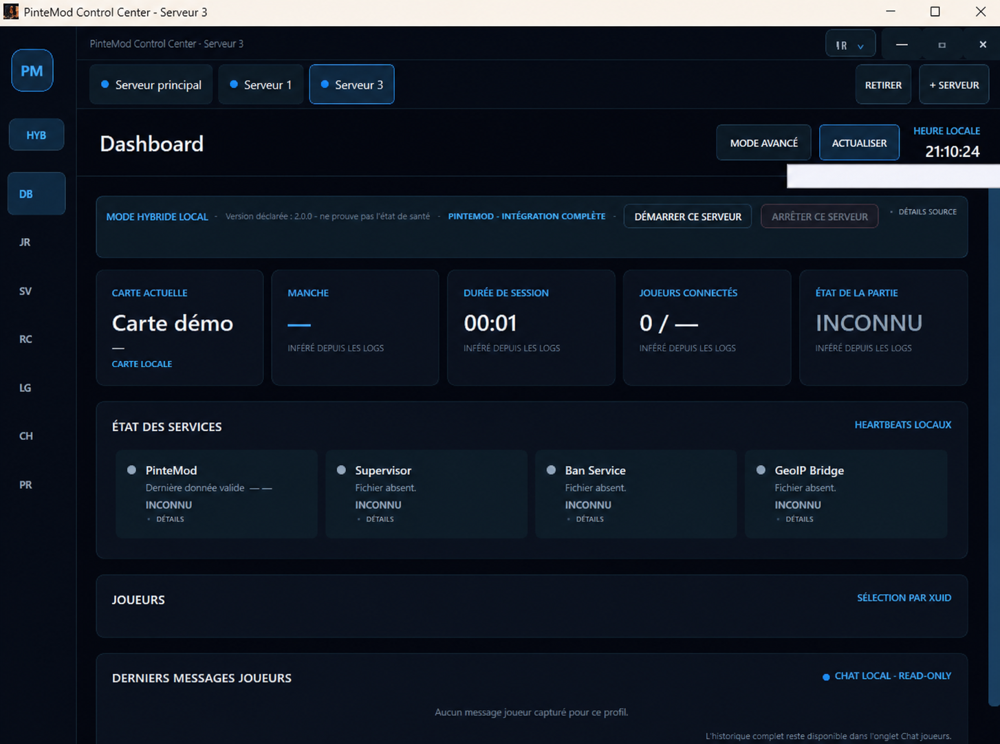

# PinteMod Control Center v2.2

[Documentation française](README_FR.md)

[](https://dotnet.microsoft.com/download/dotnet/8.0)


[](https://github.com/BiereFraiche/PinteModControlCenter/releases/tag/v2.2.0)

PinteMod Control Center is a local Windows operator application for observing and administering a **Call of Duty: Black Ops III Zombies** dedicated server running [PinteMod](https://github.com/BiereFraiche/PinteMod) on BOIII/Ezz.

Created and maintained by **BiereFraiche**, with development assistance from Codex and ChatGPT.

> **Current stable release:** v2.2.0.
> Debug and Release builds complete with **0 warnings, 0 errors and 460/460 tests passing**.
> The application starts in fully simulated mode unless an operator explicitly enables a local or read-only LAN data source.

[Download v2.2.0](https://github.com/BiereFraiche/PinteModControlCenter/releases/tag/v2.2.0)



## Highlights

- dark, responsive WPF dashboard designed for 1920×1080 and smaller windows;
- up to eight isolated server tabs, each with its own data source, RCON context and visual accent;
- current map/session, service health, players, events and operator status;
- local read-only Ranks, round records and official Easter Egg Records;
- structured Live Console with filters, search, pause, auto-scroll and neutralized copy;
- explicit Local or LAN `PinteModData` source, with no automatic server discovery;
- manual, allowlisted BOIII RCON diagnostics;
- Community Soft Pause v0.3 observation plus confirmed Pause/Resume controls;
- confirmed server actions for rounds, power, Pack-a-Punch, music, passages, zombies and power-up lifetime;
- contract-backed restart-map, boss spawn and public-server-name controls when PinteMod publishes fresh compatible capabilities;
- ephemeral BOIII connection-password control, restricted to a loopback RCON endpoint and never persisted or displayed;
- XUID-targeted player assistance, inventory grants, power-ups, moderation and roles;
- local read-only moderation history;
- hybrid map catalogue combining official maps, an explicitly pasted rotation, local custom entries and the currently observed map;
- shared mutation lock, human confirmation, conservative UDP delivery semantics and no automatic retry.

## Safety model

The Control Center is deliberately local-first:

- no web server, account system, cloud service or inbound port;
- no network discovery or broadcast;
- RCON only after an explicit operator action and only to numeric loopback/private/link-local addresses;
- the RCON secret is protected with Windows DPAPI `CurrentUser` and is never displayed again;
- players are targeted internally by stable `BOIII_XUID`, never by display name alone;
- no free-form UI text is converted into a server command;
- every real command comes from a closed allowlist;
- destructive actions require confirmation;
- no automatic retry after a mutation that may have reached BOIII;
- no direct Control Center writes inside PinteMod runtime data;
- temporary, backup, stale and partial files are handled conservatively;
- full XUIDs, IP addresses, GUIDs and filesystem paths are neutralized before display or clipboard copy;
- closing or crashing the Control Center never stops BOIII.

Ban, Mute and Role commands may ask PinteMod itself to perform its normal administrative persistence after explicit confirmation. The Control Center does not edit those files directly.

## Current data modes

### Simulation — default

Launching without configuration uses realistic simulated data. Simulation actions keep `CommandSent = false` and never contact a server.

### Hybrid local read-only

Hybrid mode overlays approved local PinteMod sources onto the simulated baseline. It can be enabled from **Settings** or explicitly with:

```powershell
PinteMod.ControlCenter.exe --data-mode=hybrid-local --server-root="C:\Servers\UnrankedServer"
```

The root must be absolute and explicit. The application never searches for an installation and never selects `server-sandbox/` automatically.

For a separate operator PC, the recommended source is a read-only share containing only:

```text
boiii/scriptdata/pintemod/
```

Do not share the whole game/server directory and never expose SMB or BOIII RCON to the Internet.

## Architecture

```text
app/
├── src/
│   ├── PinteMod.ControlCenter/                WPF presentation and ViewModels
│   ├── PinteMod.ControlCenter.Core/           models, contracts and validation
│   └── PinteMod.ControlCenter.Infrastructure/ local readers, simulation and RCON
├── tests/PinteMod.ControlCenter.Tests/        MSTest regression suite
├── packaging/                                 portable-package documentation
└── PinteMod.ControlCenter.sln
```

Dependencies flow toward Core. WPF ViewModels are constructor-injected and testable. Local readers and RCON services implement narrow interfaces and can be replaced without coupling domain models to WPF.

## Build and test

Requirements:

- Windows 10/11;
- .NET 8 SDK.

```powershell
dotnet restore .\app\PinteMod.ControlCenter.sln --configfile .\app\NuGet.Config
dotnet build .\app\PinteMod.ControlCenter.sln -c Debug --no-restore
dotnet test .\app\PinteMod.ControlCenter.sln -c Debug --no-build --no-restore
dotnet build .\app\PinteMod.ControlCenter.sln -c Release --no-restore
dotnet test .\app\PinteMod.ControlCenter.sln -c Release --no-build --no-restore
```

Run from source:

```powershell
dotnet run --project .\app\src\PinteMod.ControlCenter\PinteMod.ControlCenter.csproj -c Debug
```

No BOIII server, BAT file or external tool is launched by these commands.

## Real and simulated controls

Stable, audited controls are enabled only when their targeting and verification rules are known. Restart Map, supported boss aliases, public hostname changes and clearing the connection password use closed PinteMod contracts with local correlated feedback. Setting the BOIII connection password is available only through an explicitly configured loopback RCON endpoint and the value remains ephemeral.

Generic Change Map and generic events remain visibly simulated because no sufficiently safe, authoritative contract exists for them. A missing, stale or incompatible capability never becomes an available real action.

Detailed future PinteMod requirements are documented in [`docs/PINTEMOD_REQUIREMENTS_NEXT.md`](docs/PINTEMOD_REQUIREMENTS_NEXT.md), including a dedicated heartbeat, authoritative runtime snapshot, map capabilities and structured mutation feedback.

## Repository map

- [`app/README.md`](app/README.md) — complete technical and operator documentation;
- [`docs/CODEX_PROGRESS.md`](docs/CODEX_PROGRESS.md) — chronological implementation handoff;
- [`docs/DECISIONS.md`](docs/DECISIONS.md) — architecture and security decisions;
- [`docs/TODO.md`](docs/TODO.md) — remaining, blocked and validation work;
- [`contracts/`](contracts/) — JSON contracts used during design;
- [`design/`](design/) — validated visual direction;
- [`reference/`](reference/) — frozen public PinteMod reference used for audits.

Generated builds, portable archives, local settings, DPAPI secrets, server copies and runtime data are intentionally excluded from Git.

## Validation status

PinteMod Control Center v2.2.0 has completed its automated and field validation:

```text
Debug build     PASS — 0 warnings, 0 errors
Release build   PASS — 0 warnings, 0 errors
Debug tests     PASS — 460/460
Release tests   PASS — 460/460
ZIP audit       PASS — no PDB, private build path, forbidden XUID, secret, server file or unsafe path
Field checks    PASS — local reads, diagnostics, confirmed actions and net_password
```

The stable package is built from an identified Git commit, published as a self-contained Windows x64 archive and verified before release. Operational mutations remain manual, confirmed and protected by conservative delivery semantics.

## Related project

PinteMod server framework and stable v2.1.1 documentation:

- <https://github.com/BiereFraiche/PinteMod>

PinteMod Control Center is an independent operator UI. It does not include or replace BOIII, Black Ops III or proprietary game assets.

## Security

Read [`SECURITY.md`](SECURITY.md) before reporting a vulnerability or sharing diagnostic material. Never open an issue containing an RCON password, DPAPI file, full XUID, private IP, server path or runtime archive.
